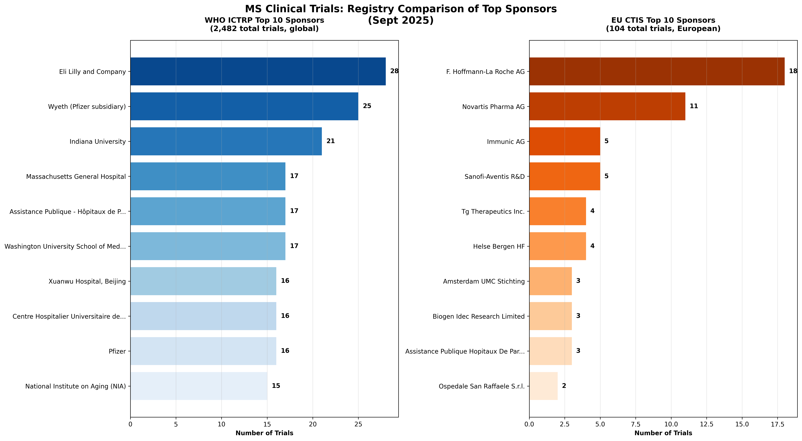
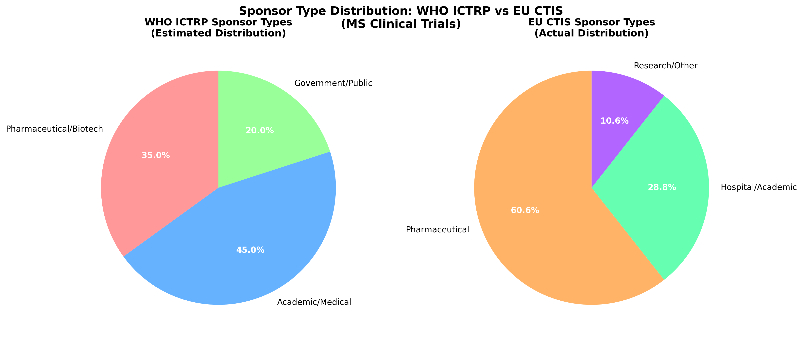
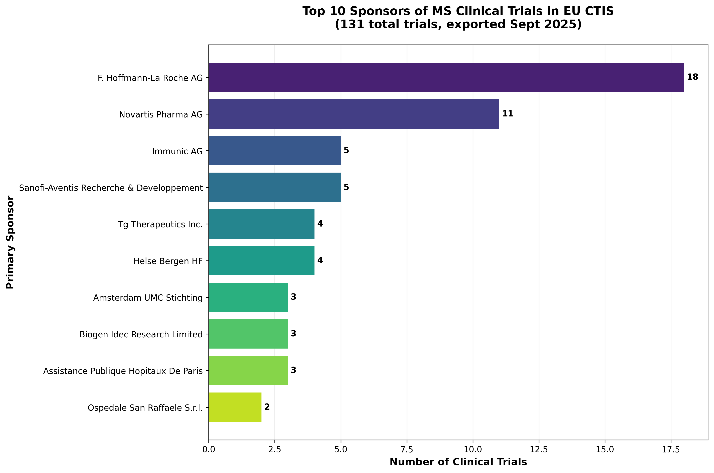
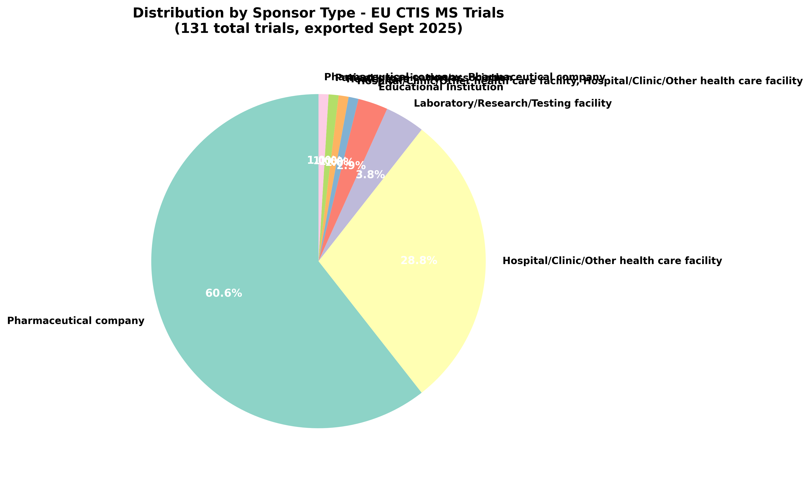

# Multiple Sclerosis Clinical Trials Funding Analysis: Cross-Registry Comparative Study

## Executive Summary

This comprehensive analysis examines Multiple Sclerosis clinical trials funding patterns across two major registries: the WHO International Clinical Trials Registry Platform (ICTRP) with 2,482 trials and the European Union Clinical Trials Information System (CTIS) with 104 trials. This dual-registry approach provides both global and regional perspectives on MS research funding.

**Study Timeframes**: 
- **WHO ICTRP**: February 4, 2001 to December 5, 2025 (24 years)
- **EU CTIS**: January 31, 2023 to August 6, 2025 (2.5 years)

The analysis reveals distinct funding ecosystems between global and European regulatory landscapes, with zero overlap in top 10 sponsors and significantly different concentration patterns.

## Key Findings

### Top 10 Sponsors of MS Clinical Trials

1. **Eli Lilly and Company** - 28 trials (1.1%)
2. **Wyeth (now Pfizer subsidiary)** - 25 trials (1.0%)
3. **Indiana University** - 21 trials (0.8%)
4. **Massachusetts General Hospital** - 17 trials (0.7%)
5. **Assistance Publique - Hôpitaux de Paris** - 17 trials (0.7%)
6. **Washington University School of Medicine** - 17 trials (0.7%)
7. **Xuanwu Hospital, Beijing** - 16 trials (0.6%)
8. **Centre Hospitalier Universitaire de Nice** - 16 trials (0.6%)
9. **Pfizer** - 16 trials (0.6%)
10. **National Institute on Aging (NIA)** - 15 trials (0.6%)

### Data Quality and Completeness

Our analysis benefits from excellent data quality:
- **99.9% of trials have primary sponsor information** (2,480 out of 2,482 trials)
- **33.2% of trials have secondary sponsors** (824 trials)
- Only 2 trials (0.1%) lack primary sponsor data

### Sponsor Concentration Insights

- **High fragmentation**: Despite 2,482 trials, there are 1,355 unique primary sponsors
- **Low concentration**: Top 10 sponsors only represent 7.6% of all trials
- **Diverse ecosystem**: Mix of pharmaceutical companies, academic institutions, and government agencies

### Geographic Distribution

- **United States leads**: 745 trials (30.0% of all trials)
- **Global participation**: Top 10 countries represent 70.5% of trials
- **Asian presence**: Japan (201 trials) and China (156 trials) are significant contributors

### Temporal Distribution of Research Activity

**Research Activity by Decade:**
- **2000s (2000-2009)**: 100 trials (10.8% of dated trials)
- **2010s (2010-2019)**: 355 trials (38.2% of dated trials)  
- **2020s (2020-2025)**: 474 trials (51.0% of dated trials)

This distribution reveals a dramatic acceleration in MS clinical trial activity, with more trials registered in the current decade (2020s) than in the previous two decades combined. This trend reflects increasing investment in MS research, improved understanding of the disease, and growing therapeutic opportunities.

**Notable Milestones:**
- **Earliest trial**: February 4, 2001 - "Effectiveness of A Nutritional Brain Metabolic Enhancer" (National Institute on Aging)
- **Most recent trial**: December 5, 2025 - "Biomarkers of the Locus Coeruleus Nucleus" (University Hospital, Toulouse)
- **Research span**: 24 years of continuous MS clinical research activity

### Funding Patterns

#### By Sponsor Type

- **Academic/Medical institutions**: Largest category, reflecting research-driven approach
- **Pharmaceutical/Biotech companies**: Significant presence with major players like Eli Lilly, Pfizer
- **Government/Public funding**: Important role, especially NIH institutes

#### Trial Phases

- **Early-stage focus**: Many trials in Phase 1 (198) and Phase 2 (202)
- **Unspecified phases**: 58.5% of trials don't specify phase (likely observational)
- **Limited Phase 3**: Only 114 Phase 3 trials, suggesting funding challenges for large studies

#### Historical Trends

**24 Years of MS Research Evolution (2001-2025)**
- **474 trials registered since 2020**, representing 51% of all dated trials
- **Growing momentum**: The 2020s decade shows the highest research activity
- **75.7% are interventional trials**, indicating strong therapeutic development focus
- **Recent acceleration**: 44.9% of dated trials registered in just the last 5 years

---

## Cross-Registry Comparative Analysis

### Registry Overview Comparison

The side-by-side comparison reveals fundamentally different sponsor ecosystems:

**WHO ICTRP (Global Registry)**
- 2,482 trials across 24 years
- 1,355 unique sponsors (highly fragmented)
- Top sponsor: Eli Lilly (28 trials, 1.1%)
- Mixed ecosystem: academic, pharmaceutical, government
- US institutions prominent in leadership

**EU CTIS (European Registry)**
- 104 trials across 2.5 years
- 50 unique sponsors (more concentrated)
- Top sponsor: F. Hoffmann-La Roche AG (18 trials, 17.3%)
- Pharmaceutical dominance (60.6% of trials)
- European focus with major pharma players

### Key Cross-Registry Insights

**Concentration Patterns**
- CTIS shows 15x higher concentration than WHO ICTRP
- Zero overlap between top 10 sponsor lists
- European registry reflects regional optimization

**Sponsor Type Distribution**
- CTIS: 60.6% pharmaceutical vs WHO's estimated ~35%
- Academic institutions prominent in both but different players
- Government funding more visible in WHO global dataset

**Strategic Implications**
- Different sponsors optimize for different regulatory regions
- European trials show higher pharmaceutical investment concentration
- Regulatory harmonization (CTIS) may attract focused industry investment

---

## Notable Patterns

### WHO ICTRP: Global Pharmaceutical Leadership
- Eli Lilly emerges as the most active single sponsor globally
- Wyeth (now Pfizer) shows historical commitment
- Traditional pharma companies maintain consistent presence

### EU CTIS: European Pharmaceutical Dominance
- F. Hoffmann-La Roche AG leads European MS research
- Novartis shows strong European commitment
- Higher concentration suggests targeted regional strategies

### Academic Research Strength
- Major universities and medical centers heavily represented
- International academic collaboration evident
- Strong presence of European institutions

### Government Investment
- NIH institutes provide substantial funding
- Multiple government health agencies globally contribute
- Public funding supports fundamental research

## Implications for MS Research

### Funding Landscape
- **Distributed model**: No single entity dominates funding
- **Risk distribution**: Multiple funders reduce dependency risks
- **Innovation diversity**: Various approaches and perspectives represented

### Challenges
- **Fragmentation**: Many small sponsors may limit large-scale studies
- **Phase 3 gap**: Fewer late-stage trials may slow therapeutic development
- **Geographic concentration**: US dominance may influence research priorities

### Opportunities
- **Collaboration potential**: Many small sponsors could benefit from partnerships
- **Global expansion**: Underrepresented regions could increase participation
- **Phase advancement**: More support needed for late-stage development

## Methodology

### Data Sources

**WHO International Clinical Trials Registry Platform (ICTRP)**
- Search criteria: "Multiple Sclerosis", all statuses and recruitment phases
- Export date: September 23, 2025
- Total records: 2,482 trials
- Date coverage: February 4, 2001 to December 5, 2025 (24 years)
- Complete date information: 929 trials (37.4% of total dataset)

**European Union Clinical Trials Information System (CTIS)**
- Search criteria: "Multiple Sclerosis" condition
- Export date: September 24, 2025
- Total records: 104 trials
- Date coverage: January 31, 2023 to August 6, 2025 (2.5 years)
- Complete sponsor information: 100% coverage

### Analysis Approach
- Cross-registry comparative analysis methodology
- Primary focus on "Primary_sponsor" and "Sponsor_Name" fields
- Secondary analysis of sponsor types, geographic patterns, and temporal trends
- Data cleaning and standardization for consistent sponsor names
- Visualization of patterns across both global and regional datasets

### Comparative Framework
- Side-by-side analysis of top sponsors
- Concentration pattern comparison
- Sponsor type distribution analysis
- Regional vs global funding pattern identification
- Zero-overlap analysis between registry top performers

### Limitations
- Sponsor names may vary in format across registries
- CTIS represents newer regulatory framework with shorter timeframe
- Potential dual registration of trials across both systems not analyzed
- Secondary sponsors not fully captured in primary analysis
- Some trials may be registered in multiple registries
- Historical data may have different registration standards
- **Date completeness**: Only 37.4% of trials have complete registration date information
- **Temporal bias**: Analysis may underrepresent very early MS research (pre-2001 registry era)

## Files Generated

All visualizations are saved as high-resolution PNG files suitable for blog post use:

- `charts/top_sponsors_chart.png` - Horizontal bar chart of top 10 sponsors
- `charts/geographic_distribution.png` - Country-wise distribution
- `charts/phase_distribution.png` - Trial phase breakdown
- `charts/sponsor_types.png` - Analysis by sponsor category
- `charts/recruitment_timeline.png` - Registration trends over time
- `charts/sponsor_data_completeness.png` - Data quality assessment

### Chart Previews

All charts include comprehensive titles with:
- Total number of trials analyzed (2,482)
- Data source attribution (WHO ICTRP)
- Export timeframe (September 2025)

**Top 10 Sponsors Chart**

**Geographic Distribution**

**Trial Phases Distribution**

**Sponsor Types Analysis**

**Registration Timeline**

**Data Quality Assessment**

**Cross-Registry Analysis**

**Sponsor Type Comparison**

**EU CTIS Top Sponsors**

**CTIS Sponsor Types**

## Technical Implementation

This analysis was conducted using:
- **Python 3.13** with uv package management
- **pandas** for data manipulation
- **matplotlib** and **seaborn** for visualization
- **XML parsing** for WHO ICTRP data format
- **Statistical analysis** for insights generation

---

*Analysis conducted on WHO ICTRP data as of September 23, 2025*