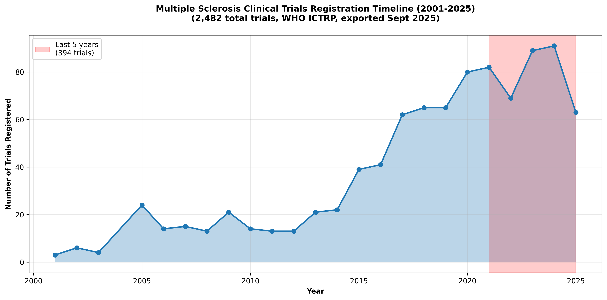

# Multiple Sclerosis Clinical Trials Funding Analysis

## Executive Summary

This analysis examines 2,482 Multiple Sclerosis clinical trials registered in the WHO International Clinical Trials Registry Platform (ICTRP) to identify the top sponsors and explore funding patterns in MS research.

## Key Findings

### Top 10 Sponsors of MS Clinical Trials

1. **Eli Lilly and Company** - 28 trials (1.1%)
2. **Wyeth (now Pfizer subsidiary)** - 25 trials (1.0%)
3. **Indiana University** - 21 trials (0.8%)
4. **Massachusetts General Hospital** - 17 trials (0.7%)
5. **Assistance Publique - Hôpitaux de Paris** - 17 trials (0.7%)
6. **Washington University School of Medicine** - 17 trials (0.7%)
7. **Xuanwu Hospital, Beijing** - 16 trials (0.6%)
8. **Centre Hospitalier Universitaire de Nice** - 16 trials (0.6%)
9. **Pfizer** - 16 trials (0.6%)
10. **National Institute on Aging (NIA)** - 15 trials (0.6%)

### Data Quality and Completeness

Our analysis benefits from excellent data quality:
- **99.9% of trials have primary sponsor information** (2,480 out of 2,482 trials)
- **33.2% of trials have secondary sponsors** (824 trials)
- Only 2 trials (0.1%) lack primary sponsor data

### Sponsor Concentration Insights

- **High fragmentation**: Despite 2,482 trials, there are 1,355 unique primary sponsors
- **Low concentration**: Top 10 sponsors only represent 7.6% of all trials
- **Diverse ecosystem**: Mix of pharmaceutical companies, academic institutions, and government agencies

### Geographic Distribution

- **United States leads**: 745 trials (30.0% of all trials)
- **Global participation**: Top 10 countries represent 70.5% of trials
- **Asian presence**: Japan (201 trials) and China (156 trials) are significant contributors

### Funding Patterns

#### By Sponsor Type

- **Academic/Medical institutions**: Largest category, reflecting research-driven approach
- **Pharmaceutical/Biotech companies**: Significant presence with major players like Eli Lilly, Pfizer
- **Government/Public funding**: Important role, especially NIH institutes

#### Trial Phases

- **Early-stage focus**: Many trials in Phase 1 (198) and Phase 2 (202)
- **Unspecified phases**: 58.5% of trials don't specify phase (likely observational)
- **Limited Phase 3**: Only 114 Phase 3 trials, suggesting funding challenges for large studies

#### Historical Trends

- **474 trials registered since 2020**, showing continued investment in MS research
- **75.7% are interventional trials**, indicating therapeutic development focus

## Notable Patterns

### Pharmaceutical Industry Leadership
- Eli Lilly emerges as the most active single sponsor
- Wyeth (now Pfizer) shows historical commitment
- Traditional pharma companies maintain consistent presence

### Academic Research Strength
- Major universities and medical centers heavily represented
- International academic collaboration evident
- Strong presence of European institutions

### Government Investment
- NIH institutes provide substantial funding
- Multiple government health agencies globally contribute
- Public funding supports fundamental research

## Implications for MS Research

### Funding Landscape
- **Distributed model**: No single entity dominates funding
- **Risk distribution**: Multiple funders reduce dependency risks
- **Innovation diversity**: Various approaches and perspectives represented

### Challenges
- **Fragmentation**: Many small sponsors may limit large-scale studies
- **Phase 3 gap**: Fewer late-stage trials may slow therapeutic development
- **Geographic concentration**: US dominance may influence research priorities

### Opportunities
- **Collaboration potential**: Many small sponsors could benefit from partnerships
- **Global expansion**: Underrepresented regions could increase participation
- **Phase advancement**: More support needed for late-stage development

## Methodology

### Data Source
- WHO International Clinical Trials Registry Platform (ICTRP)
- Search criteria: "Multiple Sclerosis", all statuses and recruitment phases
- Export date: September 23, 2025
- Total records: 2,482 trials

### Analysis Approach
- Primary focus on "Primary_sponsor" field
- Secondary analysis of "Secondary_Sponsor" and "Source_Support" fields
- Geographic, temporal, and categorical analysis
- Data cleaning and standardization for sponsor names

### Limitations
- Sponsor names may vary in format across registries
- Secondary sponsors not fully captured in primary analysis
- Some trials may be registered in multiple registries
- Historical data may have different registration standards

## Files Generated

All visualizations are saved as high-resolution PNG files suitable for blog post use:

- `charts/top_sponsors_chart.png` - Horizontal bar chart of top 10 sponsors
- `charts/geographic_distribution.png` - Country-wise distribution
- `charts/phase_distribution.png` - Trial phase breakdown
- `charts/sponsor_types.png` - Analysis by sponsor category
- `charts/recruitment_timeline.png` - Registration trends over time
- `charts/sponsor_data_completeness.png` - Data quality assessment

### Chart Previews

All charts include comprehensive titles with:
- Total number of trials analyzed (2,482)
- Data source attribution (WHO ICTRP)
- Export timeframe (September 2025)

**Top 10 Sponsors Chart**

**Geographic Distribution**

**Trial Phases Distribution**

**Sponsor Types Analysis**

**Registration Timeline**

**Data Quality Assessment**

## Technical Implementation

This analysis was conducted using:
- **Python 3.13** with uv package management
- **pandas** for data manipulation
- **matplotlib** and **seaborn** for visualization
- **XML parsing** for WHO ICTRP data format
- **Statistical analysis** for insights generation

---

*Analysis conducted on WHO ICTRP data as of September 23, 2025*